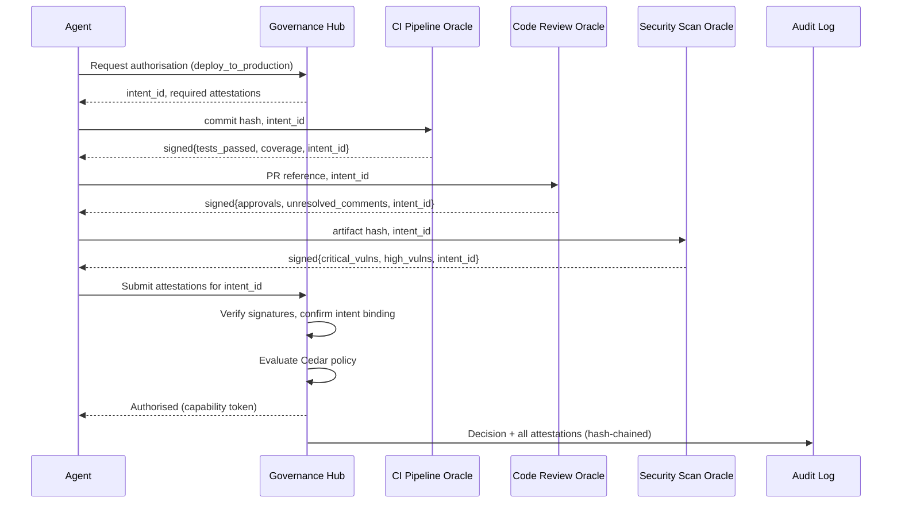
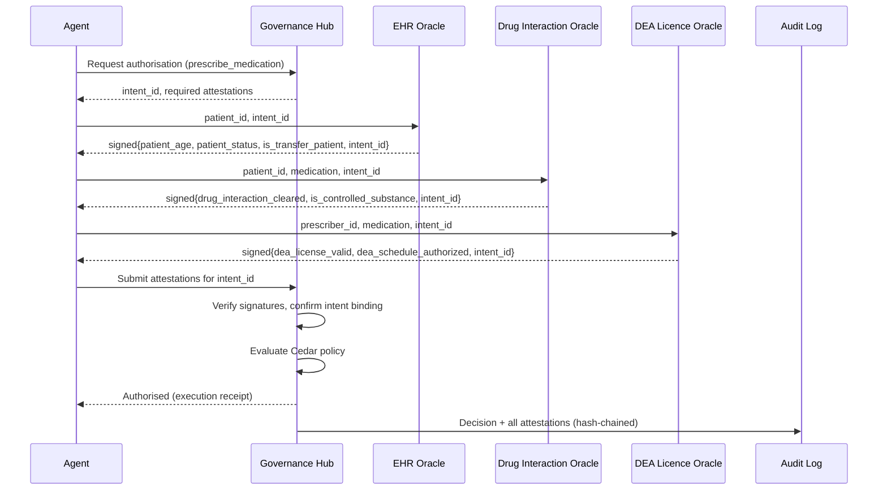

# Governing Actions, Not Agents: Institutional Attestation as a Governance Model for Autonomous AI Systems

**Jakob Salfeld-Nebgen · metaphora.ai**
Working paper · Proof-of-concept prototype: github.com/jsalfeld/zta-hub

## Abstract

Autonomous AI agents may begin to perform consequential, irreversible actions such as clinical prescribing and production software deployment. This paper observes that human institutions have governed powerful autonomous actors not by monitoring their reasoning but by requiring independently attested evidence at the point of consequential action. We formalise this institutional pattern as a computational governance model for AI agent systems. Under the proposed model, an agent retains full autonomy over planning and reasoning but holds no execution authority over designated high-risk actions. Execution is conditional on preconditions that are each independently attested by a separate authoritative source, cryptographically bound to a declared intent, and evaluated by a deterministic policy. Decisions are recorded in a tamper-evident log amenable to independent re-verification. We present a proof-of-concept design and illustrate the model with examples from software deployment and clinical prescribing.

**Keywords:** AI agent governance; institutional attestation; zero-trust architecture; policy decision point; cryptographic attestation; verifiable computation; tamper-evident audit.

## 1. Introduction

Large language model agents now plan multi-step tasks, invoke external tools, and produce side effects in systems of record without per-step human approval. This raises a governance question: under what conditions should such a system be permitted to act?

Existing approaches typically instrument the agent's runtime, intercepting tool calls, classifying behaviour, and enforcing policy over observed execution context. These mechanisms are effective for operational constraints — restricting which tools may be called, enforcing rate limits, blocking known-dangerous parameter patterns. However, they operate on the mechanics of tool invocation: the tool name, its parameters, and the shape of its response. For actions whose correctness depends on facts about the state of the world — whether a drug interaction has been checked, whether a build has passed, whether a licence is valid — the relevant information resides in authoritative external systems that the agent's runtime does not consult.

This paper proposes a governance model drawn from an older and well-tested source: institutional governance of consequential acts. Human institutions have governed powerful autonomous actors — physicians, judges, financial officers — not by monitoring their deliberation but by imposing requirements at the point of action. A controlled-substance prescription requires a verified patient record, a drug-interaction clearance, and a valid DEA registration, each attested by an independent authoritative source. The actor's reasoning is not governed; the act is, through independently attested evidence.

We formalise this pattern as a computational governance model for AI agent systems. The model rests on three commitments:

- **Actions are governed, not agents.** Governance is applied at the boundary where an agent produces an irreversible side effect, not at the boundary of its reasoning or planning.
- **Agents retain autonomy.** The agent discovers governance requirements at run time and assembles the necessary evidence without modification to its internal control flow.
- **Evidence is independently verifiable.** An action is permitted only when each of its preconditions has been attested by a distinct, independent external authority, bound to the specific intent, and evaluated by a deterministic policy. No single party — neither the agent nor any one gatekeeper — supplies the full basis for a decision; the evidence is assembled from separate attesters and the resulting decision is re-verifiable by any third party.

The primitives underlying this model are individually well-established, and several concurrent 2026 preprints develop closely related ideas: removing execution authority from the agent and binding an action to a verified intent behind a brokered admission boundary [20, 23]; deterministic pre-action authorisation with a tamper-evident audit record [19]; and an institutional, separation-of-powers framing of agent governance [21]. A related line of work examines intent-to-execution integrity [22]. Our aim is to articulate their composition into a single institutional governance model for the agent-action boundary, grounded in long-standing institutional precedent and illustrated with a proof-of-concept design. The reference implementation accompanying this paper has been publicly available since May 2026 and was developed independently of these concurrent efforts.

## 2. Institutional Governance as a Model

The institutional pattern exhibits several properties that serve as design requirements for the computational model.

**Independent attestation.** No single party's attestation is sufficient. Each precondition is verified by an independent authority — a licensing body, a records system, a testing service — with its own basis for judgement and its own credentials. The decision-maker evaluates the collected attestations but does not produce them. Trust is distributed across independent attesters rather than concentrated in the actor or in a single gatekeeper. This realises the separation-of-duty principle formalised by Clark and Wilson [1].

**Transaction binding.** Attestations are bound to a specific act. A notarised document identifies the date, the parties, and the transaction. A prior attestation cannot be substituted for the current one. This prevents both replay and the detachment of evidence from the context that gave it meaning.

**Deterministic evaluation against stated rules.** The decision follows from applying declared rules to attested facts. The rule is stated in advance, applied uniformly, and its application is reproducible. Given identical attested facts, the same rule yields the same decision. This corresponds to the policy decision point architecture described in XACML [2] and may be realised using deterministic policy languages such as Cedar [3] or Rego [4].

**Permanent, independently auditable record.** The decision, the underlying evidence, and the rule applied are recorded such that any authorised third party can later inspect and re-verify the decision. This draws on tamper-evident log constructions [5] and transparency log architectures such as certificate transparency [6]. Existing frameworks for supply-chain attestation, such as in-toto [7] and SCITT [8], address closely related problems in software provenance and provide relevant precedent for the attestation and transparency mechanisms described here.

**Autonomy of the actor.** The actor's deliberation is not governed. Governance engages only at the point of action, and then only by requiring evidence. The pattern is compatible with discretion and competence because it constrains consequences, not reasoning.

These properties are individually well-established in the security literature: zero-trust verification [9], capability security [10, 11], Byzantine fault tolerance [12], and the reference monitor concept [13]. Our aim here is to compose them into a unified governance model, motivated by institutional precedent and applied to the agent-action boundary.

## 3. The Computational Model

We formalise the institutional pattern as a governance architecture for AI agent systems. A proof-of-concept prototype, the Zero-Trust Action Hub ([github.com/jsalfeld/zta-hub](https://github.com/jsalfeld/zta-hub)), illustrates this model; we describe the abstract mechanisms and refer to the prototype for engineering detail.

### 3.1 The Courier Pattern

In conventional tool-calling architectures, the agent holds credentials and executes actions directly. Under the model proposed here, the agent holds no execution authority over governed actions. Instead, it operates as a courier through the following steps:

1. **Intent declaration.** The agent requests authorisation for a specific governed action. The governance hub issues a unique, cryptographically random intent identifier — a binding token to which all subsequent attestations must refer — and returns the list of required attestations.
2. **Evidence collection.** The agent contacts the required authoritative sources — independent services termed oracles — and collects signed attestations that each precondition holds. Each oracle verifies one condition and returns the result signed with its own private key, bound to the intent identifier.
3. **Submission and evaluation.** The agent presents the collected attestations to the governance hub. The hub verifies each signature against pre-registered public keys, confirms intent binding, and evaluates a deterministic policy over the attested facts. The default posture is deny.
4. **Conditional authorisation.** If the policy permits, the hub either executes the action on the agent's behalf or issues a signed, narrowly-scoped capability token. The decision is appended to a tamper-evident audit log.

The agent assembles evidence but cannot fabricate it, as it does not hold the oracles' signing keys. Authorisation derives from verified evidence evaluated against policy, not from the agent's standing privilege.

### 3.2 Multi-Party Attestation and Intent Binding

Each precondition is checked by an independent oracle with its own asymmetric key pair (e.g., Ed25519 [14]). No party, including the governance hub, can produce another party's attestation. Attestation envelopes may follow established formats such as DSSE [15] to facilitate interoperability. Every attestation includes the intent identifier issued at declaration, and the oracle signs the intent identifier together with its source identifier, expiry, and payload as a single canonical envelope. The identifier serves as a cryptographic binding between the specific action request and the evidence collected for it; because it falls within the signed envelope, neither the binding nor the attested facts can be altered without invalidating the signature, and an attestation produced for one intent is rejected if presented for another. This prevents both the reuse of evidence across actions and the substitution of attestations between unrelated requests. Each attestation additionally carries an expiry, also within the signed envelope; the hub rejects any attestation presented after its expiry. This bounds the interval between the moment a precondition is checked and the moment the action executes, ensuring that evidence is freshly collected for each action rather than carried over from an earlier context.

### 3.3 Deterministic Policy and Verified Computation

Attested facts are assembled into a policy context and evaluated against a declarative policy. Because evaluation is deterministic, the decision is reproducible from the recorded inputs.

When a precondition involves a computation rather than an external lookup — for example, a dosage calculation or an inference over held data — the agent may execute approved code and submit a proof of correct execution (via trusted-execution-environment attestation or a zero-knowledge argument [16]) against a registered, audited code hash. The hub verifies the proof and admits only the verified output into the policy context.

### 3.4 Tamper-Evident Audit and Action Composition

Each decision is appended to a tamper-evident audit log constructed using hash-chain or Merkle-tree techniques [5]. Every entry includes the intent identifier, the action type, the signed receipt, and a cryptographic commitment to prior entries. Altering a past record invalidates subsequent entries. Transparency log services such as those used in certificate transparency [6] or supply-chain integrity frameworks [7, 8] provide established infrastructure for this purpose. A third party can re-verify any decision by checking oracle signatures, confirming intent binding, re-evaluating the policy, and walking the log.

A successful action yields a signed execution receipt that may serve as a precondition for a subsequent action. This permits governance to compose: the policy for a later action can require verifiable evidence that a prior action was itself governed and executed.

### 3.5 Governance Discovery

Requirements for each governed action are published as machine-readable skill contracts specifying risk classification, required attestations, oracle endpoints, and input/output schemas. The agent reads these at run time and assembles evidence accordingly. Adding or modifying a governed action requires no change to the agent. This makes the governance surface scalable along the dimensions that matter organisationally: new governed actions, new attesters, and additional oracles can be introduced without modifying the agent or the hub's evaluation logic, and governance composes across actions through execution receipts (§3.4). Because attesters are independent, trust is distributed across organisational and jurisdictional boundaries rather than concentrated in one authority. Scalability here is in governance coverage, not in per-action throughput; the cost of collecting multiple attestations per action bounds applicability to high-volume routine operations.

## 4. Examples

### 4.1 Software Deployment

Consider an AI agent that has completed a feature and seeks to deploy it to a production environment. Under this model, `deploy_to_production` is a governed action requiring three independently attested preconditions.



Each oracle returns a signed attestation envelope containing its verified facts and the intent identifier. For example, the CI oracle returns:

```json
{
  "source_id": "ci_pipeline",
  "intent_id": "int-7f3a",
  "expires_at": "2026-06-23T12:05:00Z",
  "payload": {"tests_passed": true, "coverage": 94.2},
  "signature": "<Ed25519 signature over {source_id, intent_id, expires_at, payload}>"
}
```

Upon receiving the attestations, the hub executes the following verification pipeline before policy evaluation:

1. **Signature verification.** For each attestation, the hub retrieves the oracle's pre-registered public key by `source_id` and verifies the Ed25519 signature over the canonical envelope — the source identifier, intent identifier, expiry, and payload. An invalid or unrecognised signature rejects the request.
2. **Intent binding.** The hub confirms that the `intent_id` in each attestation matches the intent declared at step 1. A mismatch — indicating a replayed or substituted attestation — rejects the request.
3. **Freshness.** The hub confirms that each attestation is presented before its expiry. An expired attestation rejects the request, so stale evidence cannot be carried over from an earlier action.
4. **Completeness.** The hub confirms that all attestations required by the skill contract are present. A missing attestation rejects the request.
5. **Context assembly.** The verified payload fields from all attestations are merged into a single policy context; where two oracles would contribute the same field name, the field is qualified by its source identifier. Only data extracted from signature-verified, intent-bound attestations enters this context.

The hub then evaluates the Cedar policy over the assembled context:

```
permit(
    principal,
    action == Action::"deploy_to_production",
    resource
) when {
    context.tests_passed == true &&
    context.coverage >= 80 &&
    context.approvals >= 2 &&
    context.unresolved_comments == 0 &&
    context.critical_vulns == 0 &&
    context.high_vulns == 0
};
```

The decision and all supporting evidence — including the original signed attestations — are recorded in the audit log and remain independently re-verifiable.

### 4.2 Clinical Prescribing

Consider an AI clinical agent that determines a patient requires a controlled substance. Under this model, `prescribe_medication` is a governed action requiring three independently attested preconditions.



Each oracle returns a signed attestation envelope. For example, the drug interaction oracle returns:

```json
{
  "source_id": "drug_interaction_oracle",
  "intent_id": "int-9d2e",
  "expires_at": "2026-06-23T12:05:00Z",
  "payload": {"drug_interaction_cleared": true, "is_controlled_substance": true},
  "signature": "<Ed25519 signature over {source_id, intent_id, expires_at, payload}>"
}
```

The hub executes the same verification pipeline as in Section 4.1: signature verification against pre-registered public keys, intent binding confirmation, completeness check, and context assembly from verified payloads only. It then evaluates:

```
permit(
    principal,
    action == Action::"prescribe_medication",
    resource
) when {
    context.drug_interaction_cleared == true &&
    context.dea_license_valid == true &&
    context.patient_age >= 18 &&
    (if context.is_controlled_substance == true then
        context.dea_schedule_authorized == true else true) &&
    (if context.is_transfer_patient == true then
        context.prior_actions.release_medical_records.status == "executed"
        else true)
};
```

The final clause illustrates action composition. If the patient is a transfer patient, the policy requires that a prior governed action, `release_medical_records`, was executed under the same governance regime. The evidence for this is a signed execution receipt issued by the hub upon completion of the prior action — itself a verified attestation that enters the policy context through the same signature-verification pipeline, surfaced under `prior_actions.release_medical_records`.

## 5. Limitations and Scope

**Coverage depends on action classification.** Only designated actions are governed. The model does not determine which actions are high-risk; that classification is an organisational judgement and a prerequisite for deployment.

**Oracle integrity is a foundational assumption.** The hub verifies that an oracle signed an attestation, not that the attested fact is true of the world. A compromised oracle or a leaked signing key undermines the guarantees for the conditions it covers. Oracle independence, operational integrity, and key custody are load-bearing assumptions.

**Time-of-check to time-of-use.** A precondition is attested at one moment and the action executes at another; in the interval, the underlying fact may change — a licence may be revoked, a build superseded, a drug interaction newly identified. The expiry carried by each attestation controls this risk by bounding the interval: evidence expires and must be re-collected, so the gap between check and use is limited to the validity window rather than left open indefinitely. The risk is bounded, not eliminated. Within the window the world may still change, and for facts that can change abruptly the window must be set short, or supplemented by a revocation check or re-attestation immediately before execution.

**Intent-matching is not assured.** The model verifies that declared preconditions for a declared action are satisfied. It does not verify that the agent's declared intent corresponds to the human principal's actual goal. An agent that requests a correctly governed action for the wrong reason — or that decomposes a harmful goal into individually legitimate governed steps — is not prevented by this model. This residual risk is shared with institutional governance: a physician who orders a legitimate prescription for an illegitimate purpose satisfies the procedural requirements while violating their spirit. Complementary measures, including human-in-the-loop review for novel or unusual patterns, compose with evidence-gating to address this gap.

**Policy correctness is not assured by the model.** The model guarantees faithful enforcement of a stated policy. Whether the policy expresses the correct rule is an organisational responsibility.

**Governance of the path versus governance of the boundary.** The model governs whether preconditions hold at the point of action; it does not prescribe the sequence of steps the agent takes to reach that point. When the ordering or manner of steps is itself safety-relevant — for instance, when a specific protocol must be followed regardless of outcome — prescriptive workflow governance is more appropriate. The two approaches address different concerns and may be combined.

**Operational cost.** Collecting attestations from multiple external services introduces latency and engineering overhead. This cost is proportionate for high-stakes actions but may be disproportionate for routine operations.

**Relevance to identified risks.** The model is particularly relevant to the rogue agent problem [17], where a compromised agent operates within its authorised scope while pursuing adversarial objectives — a scenario in which runtime behavioural monitoring is structurally ineffective because individual actions conform to expected patterns. The model also reaches a failure mode that is structurally inaccessible to the prevailing safety layers. When an action is locally well-formed — the right tool, plausible parameters — but its correctness depends on a fact about the world (a build passed, a licence is valid, an interaction was checked), alignment, runtime behavioural monitoring, and sandboxing cannot adjudicate it, because that fact is absent from the execution context they observe. Evidence-gating admits the action only against the fact itself, independently attested and beyond the agent's control to fabricate. This control extends only to governed actions and does not, on its own, address an agent pursuing an adversarial objective through individually legitimate governed steps. It also provides a compliance path for audit requirements that demand independently verifiable decision records [18], as the signed attestations and tamper-evident log support third-party reconstruction without reliance on operator attestation.

**Relationship to runtime governance.** Runtime governance mechanisms — tool-call interception, deny-lists, rate limiting, response scanning — enforce operational constraints across the broad surface of agent activity. They are effective for rules expressible in terms of tool-call mechanics: which tools may be invoked, how frequently, and with what parameter shapes. The model proposed here addresses a distinct requirement: establishing whether the substantive, real-world preconditions for a consequential action have been independently verified. The relevant facts — whether a build passed, whether a licence is valid, whether a drug interaction was checked — reside in authoritative external systems and are not available in the tool-call execution context. The two approaches operate at different levels of abstraction. A deployment that combines runtime governance for operational breadth with institutional attestation for high-stakes actions would address both concerns.

## 6. Conclusion

For consequential actions, the governance question is not whether an agent may invoke a particular tool, but whether the real-world preconditions for the action have been independently established. Human institutions have addressed this question by requiring independently attested evidence at the point of action rather than by governing the actor's reasoning. This paper formalises that institutional pattern as a computational governance model: intent declaration, multi-party cryptographic attestation, transaction binding, deterministic policy evaluation, and tamper-evident audit. The constituent primitives are well-established, and several concurrent efforts develop related mechanisms; the aim of this paper is to compose them into a coherent institutional governance model for autonomous AI systems, grounded in institutional precedent.

The open problem is not primarily technical. It is the question of which actions warrant this level of governance and what evidence should be required — a question that remains one of judgement and accountability.

## References

[1] D. D. Clark and D. R. Wilson, "A Comparison of Commercial and Military Computer Security Policies," IEEE Symposium on Security and Privacy, 1987.

[2] OASIS, "eXtensible Access Control Markup Language (XACML) Version 3.0," OASIS Standard, 2013.

[3] J. Cutler et al., "Cedar: A New Language for Expressive, Fast, Safe, and Analyzable Authorization," Proc. ACM on Programming Languages (OOPSLA), 2024.

[4] The Open Policy Agent Authors, "Rego Policy Language," https://www.openpolicyagent.org/docs/latest/policy-language/.

[5] R. C. Merkle, "A Digital Signature Based on a Conventional Encryption Function," Advances in Cryptology (CRYPTO '87), 1988.

[6] B. Laurie, A. Langley, and E. Kasper, "Certificate Transparency," RFC 6962, Internet Engineering Task Force, 2013.

[7] S. Torres-Arias, H. Afzali, T. K. Kuppusamy, R. Curtmola, and J. Cappos, "in-toto: Providing farm-to-table guarantees for bits and bytes," USENIX Security Symposium, 2019.

[8] IETF SCITT Working Group, "An Architecture for Trustworthy and Transparent Digital Supply Chains," Internet-Draft, 2024.

[9] S. Rose, O. Borchert, S. Mitchell, and S. Connelly, "Zero Trust Architecture," NIST Special Publication 800-207, 2020.

[10] J. H. Saltzer and M. D. Schroeder, "The Protection of Information in Computer Systems," Proceedings of the IEEE, vol. 63, no. 9, 1975.

[11] M. S. Miller, "Robust Composition: Towards a Unified Approach to Access Control and Concurrency Control," Ph.D. dissertation, Johns Hopkins University, 2006.

[12] L. Lamport, R. Shostak, and M. Pease, "The Byzantine Generals Problem," ACM Transactions on Programming Languages and Systems, vol. 4, no. 3, 1982.

[13] J. P. Anderson, "Computer Security Technology Planning Study," Technical Report ESD-TR-73-51, US Air Force Electronic Systems Division, 1972.

[14] D. J. Bernstein, N. Duif, T. Lange, P. Schwabe, and B.-Y. Yang, "High-Speed High-Security Signatures," Journal of Cryptographic Engineering, vol. 2, 2012.

[15] E. Engelke and S. Torres-Arias, "Dead Simple Signing Envelope," https://github.com/secure-systems-lab/dsse, 2021.

[16] S. Goldwasser, S. Micali, and C. Rackoff, "The Knowledge Complexity of Interactive Proof Systems," SIAM Journal on Computing, vol. 18, no. 1, 1989.

[17] OWASP, "Top 10 for Agentic Applications," OWASP GenAI Security Project, 2025. See ASI10: Rogue Agents.

[18] European Parliament and Council, "Regulation (EU) 2024/1689 laying down harmonised rules on artificial intelligence (Artificial Intelligence Act)," Article 12: Record-keeping, 2024.

[19] U. Uchibeke, "Before the Tool Call: Deterministic Pre-Action Authorization for Autonomous AI Agents," arXiv preprint arXiv:2603.20953, 2026.

[20] J. He and D. Yu, "Sovereign Execution Broker: Enforcing Certificate-Bound Authority in Agentic Control Planes," arXiv preprint arXiv:2606.20520, 2026.

[21] A. Ruan, "From Logic Monopoly to Social Contract: Separation of Power and the Institutional Foundations for Autonomous Agent Economies," arXiv preprint arXiv:2603.25100, 2026.

[22] W. Qu, M. Xu, P. Wang, S. Zhai, J. Zhang, and D. Song, "Securing LLM Agents Need Intent-to-Execution Integrity," arXiv preprint arXiv:2605.16976, 2026.

[23] J. He and D. Yu, "Sovereign Assurance Boundary: Certificate-Bound Admission for Agentic Infrastructure," arXiv preprint arXiv:2606.11632, 2026.
